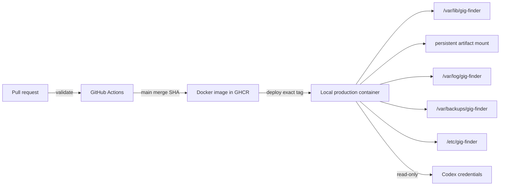

# ADR 0007: Deploy Docker images with external state and verified rollback

**Status:** Accepted
**Date:** 2026-08-05

## Context

GigFinder holds private mutable state, while each application release must be
traceable to reviewed source and recoverable after migration or startup
failure. Building in production or embedding state in a Docker image weakens
both properties.

## Decision

- CI validates a revision, builds its Docker image once, smoke-tests it
  with synthetic state, and publishes it under an immutable commit-addressed tag.
- Production deploys that exact Docker image without rebuilding it locally.
- Databases, documents, configuration, logs, backups, and credentials remain
  outside the Docker image in operator-managed locations.
- Before cutover, deployment stops runtime writes, backs up SQLite, runs
  database migrations with the new Docker image, and validates the database.
- Runtime artifacts are a dedicated persistent mount available to the
  application container. Deployment maintenance cannot mount, enumerate,
  synchronize, back up, or restore that directory.
- The replacement must report healthy at the requested revision before the
  previous container is removed.
- Migration, startup, health, or post-cutover database failure restores SQLite
  with the prior container, which reuses the unchanged artifact mount.
  Bypassing this verified deployment path is unsupported.

## Consequences

- A running release is attributable to reviewed source and a published Docker
  image.
- Pull-request validation and release publication share the same build path.
- Private state cannot enter source or build artifacts.
- Artifact backup and full path/hash integrity auditing are separate operational
  concerns and do not add work proportional to artifact count to deployment.
- Deployment depends on Docker registry availability and maintained external
  state, backup, and credential directories.
