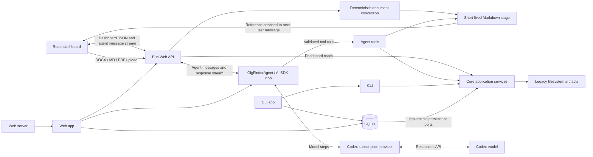

# Architecture overview

The application is a Bun and TypeScript repository with one shared domain.



- `src/core/` owns domain models, ports, validation, and application services.
- `src/data/` implements persistence, auditing, artifacts, and context paths.
- `src/cli/` adapts commands to shared services.
- `src/agent/` owns agent policy, profile composition, model runtime, and tools.
- `src/web/` owns the Bun server, application assembly, HTTP API, and React
  dashboard.
- `src/operations/` contains executable database maintenance and context-copy
  programs used by operators and deployment automation.
- Each module keeps implementation files at its root and unit tests under
  `test/`; `src/web/client/` contains browser-only React code.

The React dashboard owns session-only agent layout and side-panel width. Changing
between side-panel and full-screen layouts keeps one mounted agent session and
does not change the agent or HTTP contracts. Full-screen layout places identity
and controls in a full-height left rail.

The core application owns the typed agent-model catalog and settings service.
The web API reads and updates the selected model through that service, and each
agent request resolves the setting before constructing its model. The generic
`application_settings` table persists the preference; `CODEX_AGENT_MODEL`
supplies a validated startup default only when no preference is stored.

Gigs, people, gig-person relationships, tasks, and
meetings expose caller-neutral query/read services from `GigFinderApplication`;
agent tools receive only those narrow capabilities. Document lookup uses a
separate shared document reader. There is no agent-specific domain context
facade.

Task creation and updates use the same core task service from the agent and
CLI. The agent adapter supplies strict tool operations and audit identity; core
validates relationships and lifecycle dates before generic persistence writes.

- `src/web/server.ts` launches the server; `src/web/app.ts` assembles its
  dependencies. `src/cli/app.ts` assembles and runs the CLI.

## Persistence and history

- Mutable entities use revision numbers, soft deletion, and generic change
  transactions in `src/data/store.ts`.
- Each mutable entity table in `src/data/schema.ts` has a companion
  `*_history` table; updates and deletes copy the prior revision there with its
  operation and `change_id`. Reversible task and relationship creations also
  record a `create` entry.
- The `changes` table groups all records written by one transaction into one
  audited change.
- Meeting attendees use versioned participant and participant-history tables;
  migration retains exact legacy relationship values on historical Meeting
  snapshots rather than guessing historical attendees.
- Managed documents and their immutable versions live in the document tables;
  `candidate_profiles` supplies the Profile relationship target, and current
  Profile context Markdown is a repairable projection of SQLite. The stored
  materialized version identifies failed or interrupted writes for retry.
  Legacy job-description and interview-prep files remain filesystem artifacts.
- `application_settings` stores operator preferences outside entity revision
  history; the core service validates values before the generic adapter writes.
- Person identity, relationship, and outreach share `people` and
  `person_history`; migration 0013 coalesces legacy snapshots by Person ID and
  change ID before removing the separate networking tables.

## Context Files

Private paths default below `context/`. `GIG_FINDER_CONTEXT_ROOT` changes that
root; `GIG_FINDER_CONFIG` can place `config.json` independently for production;
`GIG_FINDER_PROFILE`, `GIG_FINDER_DATABASE`, `GIG_FINDER_ARTIFACTS`,
`GIG_FINDER_PROFILE_DOCUMENTS`, `LOG_DIRECTORY`, and
`GIG_FINDER_BACKUP_ROOT` override individual paths. Profile context Markdown
defaults to `context/profile/documents/`; `config.json` can set
`profileDocuments` to a descendant path relative to the context root, while the
environment override may be absolute.
`GIG_FINDER_MEETING_PARTICIPANT_MIGRATION` overrides the private, typed legacy
Meeting mapping used only by migration 0010.
`GIG_FINDER_ACTOR` overrides the configured audit actor.
Legacy `JOB_SEARCH_*`, `job-search.sqlite`, profile, artifact, and backup names
remain read-compatible so existing private context does not need to move.

`bun run db:migrate` creates a verified backup, preflights required private
Meeting mappings, applies pending migrations, and validates the result.

For local development, `bun run dev:restart` replaces any running API,
dashboard, and AI SDK DevTools processes and supervises their replacements.

## Build and deployment

```mermaid
flowchart LR
  PR[Pull request] -->|validate| Actions[GitHub Actions]
  Actions -->|main merge SHA| GHCR[GHCR multi-architecture image]
  GHCR -->|manual deploy script| OrbStack[OrbStack container :3001]
  OrbStack --> State[/var/lib/gig-finder]
  OrbStack --> Logs[/var/log/gig-finder]
  OrbStack --> Backups[/var/backups/gig-finder]
  OrbStack --> Config[/etc/gig-finder]
  OrbStack -->|read-only| Codex[Codex credentials]
```

`.github/workflows/ci.yml` runs checks and builds on GitHub; successful `main`
revisions publish immutable `sha-<commit>` and moving `latest` tags. The image
uses the same `server.js` process as other hosts, supplying `HOST`, `PORT`,
`STATIC_ROOT`, and `APP_REVISION`; it includes the version-matched PDF.js worker
required for server-side PDF conversion and never runs Vite or source TypeScript.
`bin/deploy-local.sh` synchronizes the candidate profile, configuration, legacy
artifacts, and required migration mapping from `context/`; pulls only an
immutable tag; backs up and migrates the production SQLite database; replaces the container; verifies
`/healthz`, and restores the database and prior container on failure.

Development uses ports `5173` and `3101` with the ignored repository context.
Production binds only `127.0.0.1:3001` on the host and mounts standard Unix
state, log, backup, and configuration paths. Codex credentials remain outside
the repository and are mounted read-only. Tests use synthetic isolated databases.
`bin/bootstrap-production.sh` creates the initial verified production copy
without changing the development database. Structured application logs persist
at `/var/log/gig-finder/server.log` and can be inspected directly from the host.
