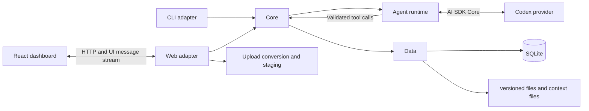

# Architecture overview

GigFinder is a Bun and TypeScript application with a framework-neutral core and
client adapters for the web dashboard, agent, and CLI.

## Package boundaries

- `src/core/` owns domain models, client-neutral contracts, validation, ports,
  conversation orchestration, framework-neutral sanitization of assistant text
  and reasoning, and application services. User-authored identifiers and
  structured tool and attachment data remain available for follow-up operations
  while web presentation omits system-added capabilities. Core has no dependency
  on client or persistence packages.
- `src/data/` implements core persistence ports, SQLite transactions, auditing,
  private context resolution, and managed filesystem projections.
- `src/agent/` adapts core capabilities to model-facing tools and AI SDK Core.
  Agent policy is separate from the configured candidate profile.
- `src/web/` owns HTTP, AI SDK UI adaptation, uploads and conversion, static
  assets, and the React dashboard. Browser code does not construct data
  adapters.
- `src/cli/` translates commands and flags into the same core contracts used by
  other clients.
- `src/operations/` contains operator-facing database and deployment programs.
- `src/web/app.ts` and `src/cli/app.ts` are composition roots; only composition
  roots construct concrete data adapters.
- Cross-client filtering, traversal, ordering, validation, lifecycle rules,
  auditing, and idempotency belong in core rather than client adapters.
- Private context and credentials never belong in source control or build
  artifacts.

## Architecture decisions

- [ADR 0001: Use operation-list patches for agent updates](decisions/0001-agent-update-contracts.md) defines the agent's strict patch envelope over client-neutral updates.
- [ADR 0002: Isolate AI SDK UI in the web package](decisions/0002-isolate-ai-sdk-ui.md) keeps framework UI types outside core, data, and agent contracts.
- [ADR 0003: Keep document content out of conversation history](decisions/0003-document-context-in-conversations.md) stores document references and hydrates exact versions when building model context.
- [ADR 0004: Share one domain input contract across create and update](decisions/0004-share-domain-input-contracts.md) makes entity-owned input schemas the source for all client adapters.
- [ADR 0005: Store mutations as revisioned, audited transactions](decisions/0005-revisioned-audited-change-transactions.md) defines atomic revision history, audit envelopes, and safe reversion.
- [ADR 0006: Make database document state authoritative](decisions/0006-authoritative-document-state.md) treats filesystem content as imports or repairable projections.
- [ADR 0007: Deploy Docker images with external state and verified rollback](decisions/0007-immutable-production-deployment.md) defines the production release and recovery model.
- [ADR 0008: Adapt domain capabilities to strict agent tools](decisions/0008-agent-tool-contracts.md) defines tool patches, schema strictness, and generated contract documentation.

Runtime settings are documented in [Configuration](configuration.md). Production
layout and procedures are documented in the [Deployment runbook](deployment-runbook.md).
