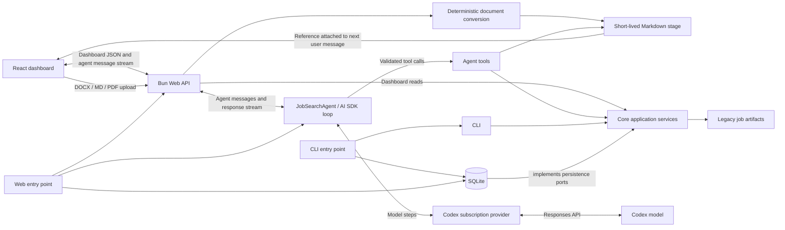

# Architecture overview

The application is a Bun and TypeScript repository with one shared domain.

- `src/core/` owns domain models, ports, validation, and application services.
- `src/sqlite/` implements persistence, auditing, artifacts, and context paths.
- `src/cli/` adapts commands to shared services.
- `src/agent/` owns agent policy, profile composition, model runtime, and tools.
- `src/web/` owns the Bun HTTP API and React dashboard.

Jobs, people, networking contacts, job-person relationships, and tasks expose
caller-neutral query/read services from `JobSearchApplication`; agent tools
receive only those narrow capabilities. Document lookup uses a separate shared
document reader. There is no agent-specific domain context facade.
- `src/entrypoints/` owns runtime composition. Entry points resolve local
  configuration, construct SQLite-backed application services, inject them into
  the CLI or web adapter, and close runtime resources.

## Persistence and history

- all mutable entities use revision
  numbers, soft deletion, and generic change transactions within the sqllite package
- Each mutable entity table has a companion `*_history`
  ; updates and deletes copy the
  prior row there with its operation and `change_id`.
- The `changes` table groups all records written by one transaction into one
  audited change.
- Managed document metadata lives in `managed_documents`, job/person links in
  `managed_document_links`, and immutable content revisions in
  `managed_document_versions`.
- Person profiles exist only as managed documents; no profile-presence flag is
  stored on people.

## Context Files

Private paths default below `context/`. `JOB_SEARCH_CONTEXT_ROOT` changes that
root; `JOB_SEARCH_PROFILE`, `JOB_SEARCH_DATABASE`, `JOB_SEARCH_ARTIFACTS`,
`LOG_DIRECTORY`, and `JOB_SEARCH_BACKUP_ROOT` override individual paths.
`JOB_SEARCH_ACTOR` overrides the configured audit actor.

For local development, `bun run dev:restart` replaces any running API,
dashboard, and AI SDK DevTools processes and supervises their replacements.
