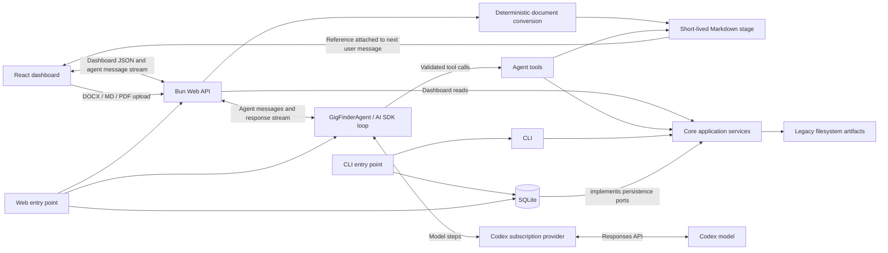

# Architecture overview

The application is a Bun and TypeScript repository with one shared domain.

- `src/core/` owns domain models, ports, validation, and application services.
- `src/data/` implements persistence, auditing, artifacts, and context paths.
- `src/cli/` adapts commands to shared services.
- `src/agent/` owns agent policy, profile composition, model runtime, and tools.
- `src/web/` owns the Bun HTTP API and React dashboard.

Gigs, people, networking contacts, gig-person relationships, tasks, and
meetings expose caller-neutral query/read services from `GigFinderApplication`;
agent tools receive only those narrow capabilities. Document lookup uses a
separate shared document reader. There is no agent-specific domain context
facade.

- `src/entrypoints/` owns runtime composition. Entry points resolve local
  configuration, construct SQLite-backed application services, inject them into
  the CLI or web adapter, and close runtime resources.

## Persistence and history

- Mutable entities use revision numbers, soft deletion, and generic change
  transactions in `src/data/src/store.ts`.
- Each mutable entity table in `src/data/src/schema.ts` has a companion
  `*_history` table; updates and deletes copy the prior revision there with its
  operation and `change_id`. Reversible relationship additions also record a
  `create` entry.
- The `changes` table groups all records written by one transaction into one
  audited change.
- Meeting attendees use versioned participant and participant-history tables;
  migration retains exact legacy relationship values on historical Meeting
  snapshots rather than guessing historical attendees.
- Managed documents and their immutable versions live in the document tables;
  legacy job-description and interview-prep files remain filesystem artifacts.

## Context Files

Private paths default below `context/`. `GIG_FINDER_CONTEXT_ROOT` changes that
root; `GIG_FINDER_PROFILE`, `GIG_FINDER_DATABASE`, `GIG_FINDER_ARTIFACTS`,
`LOG_DIRECTORY`, and `GIG_FINDER_BACKUP_ROOT` override individual paths.
`GIG_FINDER_MEETING_PARTICIPANT_MIGRATION` overrides the private, typed legacy
Meeting mapping used only by migration 0010.
`GIG_FINDER_ACTOR` overrides the configured audit actor.
Legacy `JOB_SEARCH_*`, `job-search.sqlite`, profile, artifact, and backup names
remain read-compatible so existing private context does not need to move.

`bun run db:migrate` creates a verified backup, preflights required private
Meeting mappings, applies pending migrations, and validates the result.

For local development, `bun run dev:restart` replaces any running API,
dashboard, and AI SDK DevTools processes and supervises their replacements.
