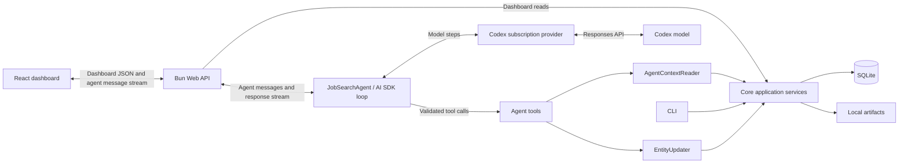

# Architecture overview

The application is a Bun and TypeScript repository with one shared domain.

- `src/core/` owns domain models, ports, validation, and application services.
- `src/sqlite/` implements persistence, auditing, artifacts, and context paths.
- `src/cli/` adapts commands to shared services.
- `src/agent/` owns agent policy, profile composition, model runtime, and tools.
- `src/web/` owns the Bun HTTP API and React dashboard.

## Persistence and history

- `store.ts` provides generic change and history behavior shared by all entity
  tables.
- Each mutable entity table has a companion `*_history` table in the
  [SQLite schema](../../src/sqlite/src/schema.ts)
- Before an update or delete, the current row is
  inserted into history with the operation and `change_id`.
- The `changes` table groups multiple record updates into one audited change.
- Each record has a revision number
- Soft deletes use `is_deleted`

## Context Files

Private paths default below `context/`. `JOB_SEARCH_CONTEXT_ROOT` changes that
root; `JOB_SEARCH_PROFILE`, `JOB_SEARCH_DATABASE`, `JOB_SEARCH_ARTIFACTS`,
`LOG_DIRECTORY`, and `JOB_SEARCH_BACKUP_ROOT` override individual paths.
`JOB_SEARCH_ACTOR` overrides the configured audit actor.
