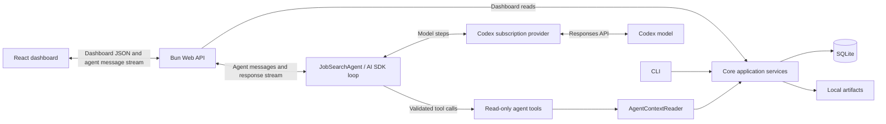

# Architecture overview

The application is a Bun and TypeScript repository with one shared domain.

- `src/core/` owns domain models, ports, validation, and application services.
- `src/sqlite/` implements persistence, auditing, artifacts, and context paths.
- `src/cli/` adapts commands to shared services.
- `src/agent/` owns agent policy, profile composition, model runtime, and tools.
- `src/web/` owns the Bun HTTP API and React dashboard.

## Persistence and history

- Each mutable entity has a live table and a companion `*_history` table in the
  [SQLite schema](../../src/sqlite/src/schema.ts).
- Before an update, deletion, or restoration, the full live row—including its current revision—is
  inserted into history with the operation and `change_id`.
- The live mutation then increments `revision`; optimistic concurrency rejects writes based on a stale
  revision, while deletion and restoration toggle `is_deleted`.
- One transaction writes the change envelope, history snapshot, live row, business events, and
  deduplicated source evidence.
- Normal reads use live, non-deleted rows; audit services query prior revisions and their associated
  changes, events, and evidence.

By default, Pino writes rotating structured logs under the private context
workspace.

Private paths default below `context/`. `JOB_SEARCH_CONTEXT_ROOT` changes that
root; `JOB_SEARCH_PROFILE`, `JOB_SEARCH_DATABASE`, `JOB_SEARCH_ARTIFACTS`,
`LOG_DIRECTORY`, and `JOB_SEARCH_BACKUP_ROOT` override individual paths.
`JOB_SEARCH_ACTOR` overrides the configured audit actor.
