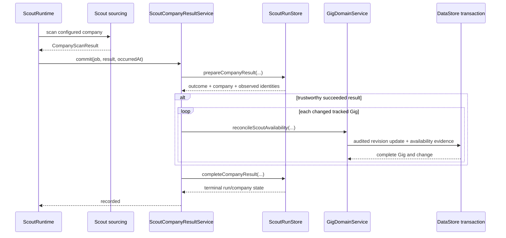

# Scout Gig Availability Domain Design

**Issue:** #140  
**Date:** 2026-08-26  
**Status:** Approved in conversation; written review pending

## Problem

Company-result persistence currently decides tracked-Gig availability and
updates `gigs` directly from `SqliteScoutRunStore`. The update increments the
live Gig revision but bypasses the Gig repository snapshot and domain change
transaction required by ADR 0005. One production run therefore left sixteen
Gigs with incomplete revision chains.

Production was restored on 2026-08-26 by taking a verified backup and removing
exactly those invalid availability mutations. The repair restored the database
to its pre-mutation state, including `unknown` availability and the preceding
Gig revisions. No reusable production repair path remains to be implemented.

The application defect remains: another availability transition would recreate
the invalid revision chain.

## Goals

- Keep the existing trustworthy-company-result availability policy.
- Move availability decisions into core Scout orchestration.
- Make availability changes first-class, audited Gig-domain mutations.
- Preserve the prior complete Gig row in `gig_history` on every change.
- Record Scout availability evidence in the same transaction as the Gig update.
- Make unchanged availability idempotent without creating a revision or audit.
- Keep company-job retry and recovery behavior deterministic.

## Non-goals

- Change Gig pipeline stage or outcome.
- Automatically close a Gig.
- Change position-to-Gig matching rules.
- Revisit whether accepted Scout filters are the correct availability input.
- Add a generic database repair framework or retain a source-controlled copy of
  the completed production repair.

## Architecture

### Core owns orchestration

Add a core `ScoutCompanyResultService` between the BunQueue runtime and the
Scout persistence port. The runtime continues to coordinate queue execution and
HTTP scanning, but hands the completed scan result to this core service.

The service performs three phases:

1. Ask the Scout store to persist the scan evidence and prepare a company
   completion containing the company outcome and exact observed position
   identities. The company remains nonterminal during this phase.
2. For a trustworthy `succeeded` outcome only, compare active tracked Gigs for
   the exact company with those observed identities and invoke the Gig domain
   for each changed availability.
3. Ask the Scout store to mark the company result terminal and finalize the run.

Partial, failed, unsupported, and suspiciously empty results never enter phase
2. The existing classification and trustworthy-result rules remain unchanged.

`src/operations/scout-runtime.ts` invokes the core service. It does not decide
availability and gains no business logic.

### Scout persistence remains Scout-only

`SqliteScoutRunStore` persists source attempts, diagnostics, positions,
observations, processing work, and company/run state. It no longer queries or
updates `gigs`, writes Gig-domain change envelopes, or inserts availability
history.

The Scout store contract is split into preparation and completion operations so
the company is not reported terminal before required Gig-domain reconciliation
succeeds. Preparation is idempotent for BunQueue retry. Completion is also
idempotent for a previously completed company result.

### Gig domain owns availability

Represent `scoutAvailability` and `scoutAvailabilityUpdatedAt` in the Gig
domain persistence model and the typed Gig repository column mapping. They are
read-only from the general Gig input contract; callers cannot edit them through
ordinary Gig create/update patches.

Add a narrowly named Gig-domain capability such as:

```ts
reconcileScoutAvailability(
  context: ChangeContext,
  gigId: string,
  input: {
    availability: "available" | "unavailable";
    runId: string;
  },
): MutationResult<GigRecord>
```

The capability:

- Loads the current active Gig.
- Uses a deterministic change ID derived from the Scout run and Gig. If that
  change already exists, it verifies the persisted availability evidence and
  current Gig agree with the requested run, Gig, and availability before
  returning the prior result.
- Returns an explicit unchanged result without a transaction when availability
  already equals the requested value and no replayed change requires
  verification.
- Otherwise executes one audited change transaction.
- Updates the Gig through the standard revision-checked repository.
- Records the prior and new availability plus Scout run ID through a dedicated
  unit-of-work evidence port in that same transaction.
- Rejects a reused change ID whose evidence or resulting Gig state differs.

The data implementation of the evidence port writes
`scout_gig_availability_history` using the transaction's change ID, actor, and
timestamp. It does not decide whether a change is allowed.

### Retry and failure behavior

The company queue job remains retryable until all required Gig availability
mutations and company finalization succeed.

- Failure before a Gig update leaves the company nonterminal; retry prepares
  the same result and resumes reconciliation.
- Failure after some Gig updates replays deterministic change IDs. Completed
  mutations are verified against their persisted evidence; Gigs that already
  had the requested availability before this run remain unchanged; remaining
  Gigs are updated.
- Failure before company finalization retries finalization without creating new
  Gig revisions.
- Retry exhaustion continues to use the existing company infrastructure-failure
  reporting path.

The implementation must not mark the company or run successful before required
availability reconciliation completes.

## Data flow



## Persistence invariants

- A changed availability increments the Gig revision exactly once.
- `gig_history` contains the complete prior Gig at revision `N` before the live
  row becomes revision `N + 1`, including prior Scout availability fields.
- The corresponding `changes`, `gig_history`, live `gigs`, and
  `scout_gig_availability_history` writes share one SQLite transaction and
  change ID.
- An unchanged availability creates none of those writes.
- No runtime SQL in the Scout store mutates a Gig table.
- A company result cannot become terminal-successful while required
  availability work remains incomplete.

## Testing

Use strict red-green-refactor TDD.

- Core service tests prove succeeded results reconcile exact observed Gig
  identities, while partial/failed results do not call the Gig capability.
- Gig-domain tests prove changed availability writes one audited revision and
  unchanged availability writes none.
- SQLite integration tests prove `gig_history` contains every revision and the
  availability evidence shares the change ID.
- Retry tests inject failure after one Gig update and prove replay completes
  without duplicate revisions or evidence.
- Company/run summary tests prove terminal status is written only after
  reconciliation succeeds.
- Architecture review verifies the Scout store contains no direct Gig mutation
  and operations contains no availability decision.
- Run `bun run check`, `bun run build`, and the existing Scout end-to-end suite.

## Documentation changes

- Amend ADR 0014: company discovery owns the reconciliation timing boundary;
  core orchestration invokes the Gig domain, which exclusively owns Gig
  mutation and audit invariants.
- Amend FRR-006 to document the trustworthy-result availability behavior and
  clarify that availability does not close or otherwise change a Gig.
- No new ADR is required because ADR 0005, ADR 0014, and ADR 0015 already decide
  the relevant ownership boundaries.

## Release

The production database is already healthy and contains none of the invalid
availability mutations. Do not run Scout before the corrected release.

After normal review and CI:

1. Publish and deploy the immutable corrected image using the deployment agent.
2. Verify migration, database integrity, foreign keys, revision chains, queue
   startup, and exact deployed revision.
3. Keep issue #140 in Development until a later successful Scout run confirms
   that any availability transition preserves complete Gig revision history.
4. Mark the issue Done only after that production verification.
